# Laporan Praktikum Jarkom Week1 modul 1 dan 2

## Tujuan Praktikum 

Perkenalan software wireshark dan kegunaannya

# Langkah Awal
1. Downlaod ISO Wireshark
2. Instalasi Wirsehark
3. Selesaikan Procedure instalasi yang muncul ketika akan memasang Wireshark di Perangkat
4. jika sudah wireShark dapat digunakan
# Langkah Penggunaan Wireshark
1. Buka Wireshark yang telah didownload
2. pilih menu wifi/ethernet yang tersedia pada halaman awal
3. Pada pojok kiri atas terdapat tombol pause
4. masuk pada link  http://gaia.cs.umass.edu/wiresharklabs/INTRO-wireshark-file1.html setelah itu kembali pada wireshark
5. setelah itu pada pojok kiri atas setelah tombol pause pilih option capture
6. setelah tkean capture disitu terdapat pilihan Option lalu tekan
7. pada menu option terdapat menu wifi lagi lalu tekan
8. ketik "http" pada kolom search 
9. jika berhasil, Temukan pesan HTTP GET yang dikirim dari komputer ke server gaia.cs.umass.edu. Caranya, cari pada bagian “daftar paket yang diambil” di jendela Wireshark (seperti pada Gambar 2.3 dan 2.6) yang menampilkan tulisan “GET” diikuti URL gaia.cs.umass.edu yang telah dimasukkan. Setelah memilih pesan HTTP GET tersebut, informasi mengenai frame Ethernet, datagram IP, segmen TCP, serta header pesan HTTP akan muncul di jendela detail paket (packet header). Kemudian, klik tanda “+” dan “–” atau panah yang mengarah ke kanan dan ke bawah di sisi kiri jendela detail paket untuk meminimalkan tampilan informasi Frame, Ethernet, Internet Protocol, dan Transmission Control Protocol.
10. Jika sudah jangan lupa lakukan Screen Capture sebagai bukti jika berhasil

## Lampiran
Hasil Percobaan:
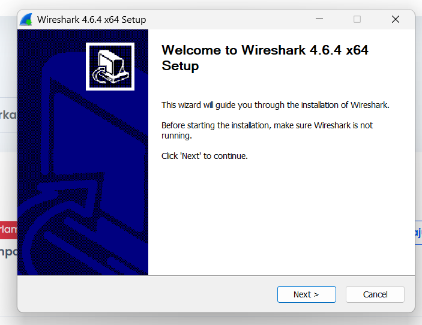
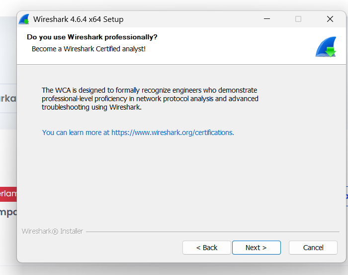
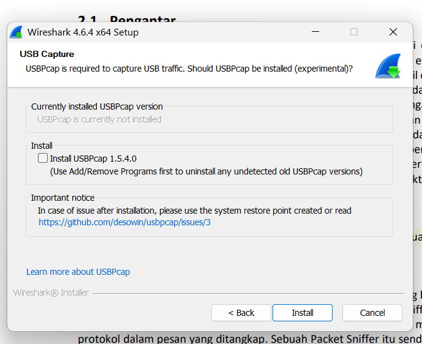 
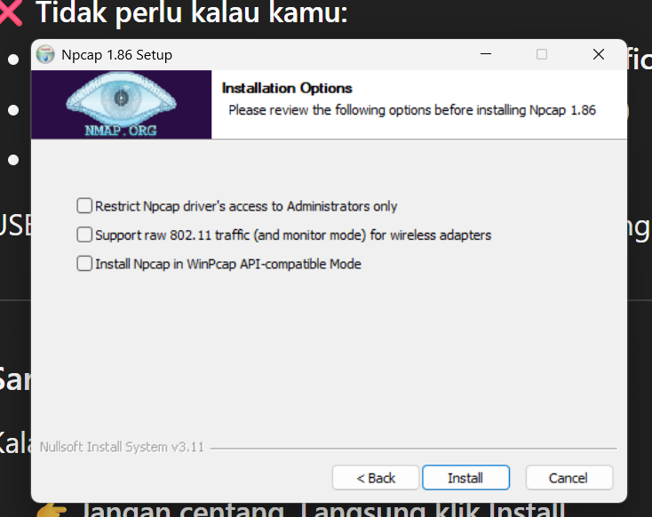
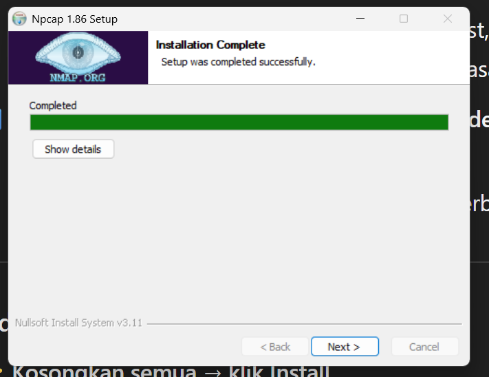
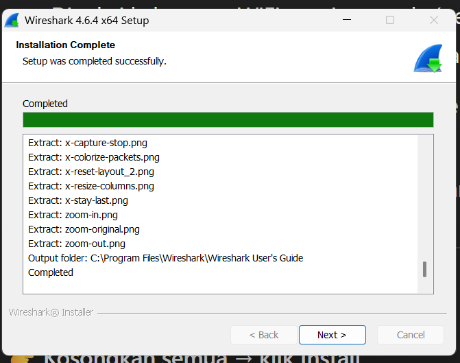
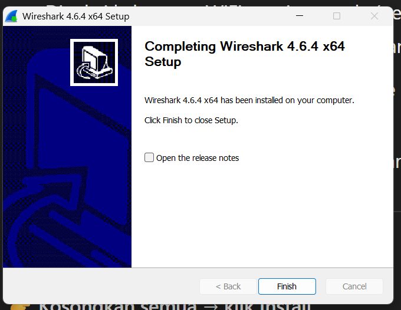
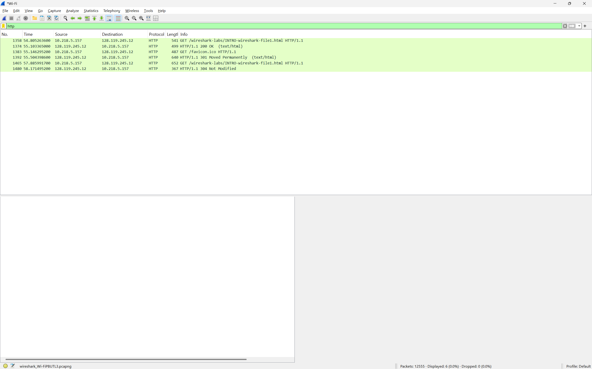
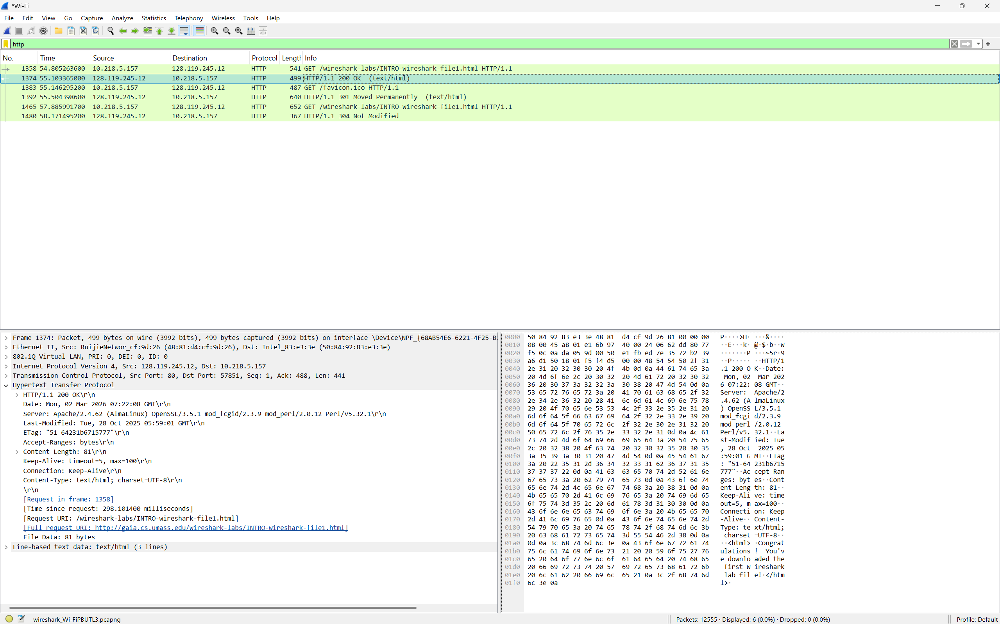
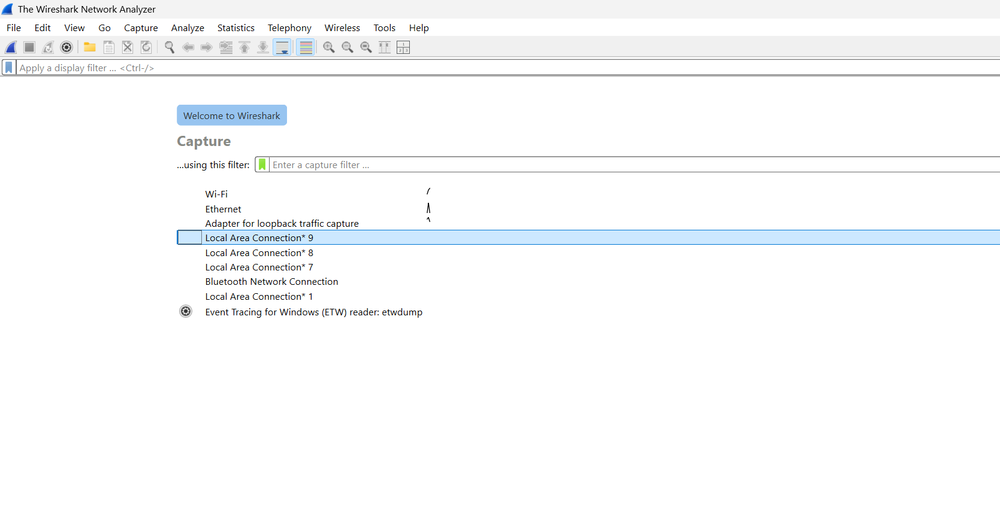
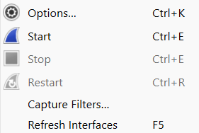
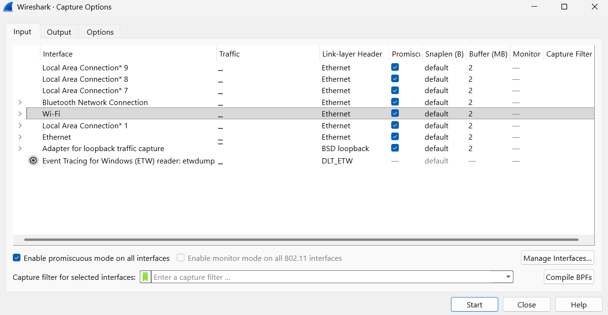